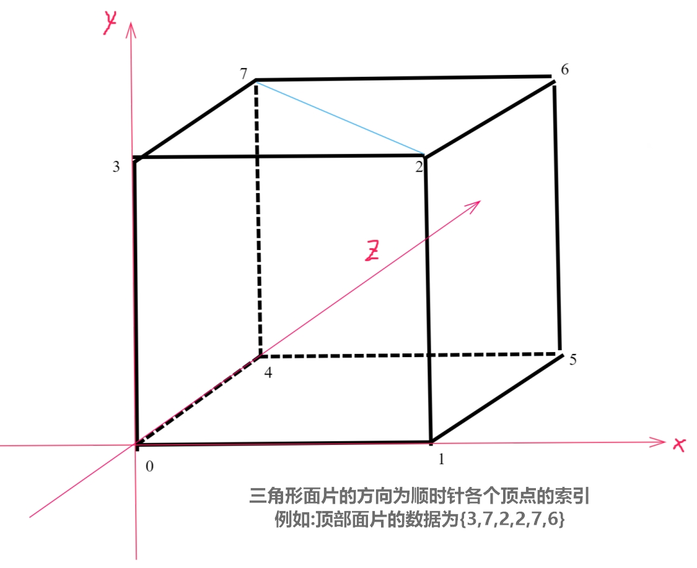

# Minecraft
基于Unity的我的世界复刻,地图生成和加载

### 1.Mesh网格生成器
GameObject上需要MeshReneder和MeshFilter组件,MeshFilter主要是存储顶点,片元,UV数据,之后交给MeshReneder来渲染
###### 图解

###### 立方体顶点和三角片元数据
```csharp
public static class VoxelData {
    //存储体素的八个顶点信息
    public static readonly Vector3[] voxelVerts = new Vector3[8] {
        new Vector3(0f, 0f, 0f),
        new Vector3(1f, 0f, 0f),
        new Vector3(1f, 1f, 0f),
        new Vector3(0f, 1f, 0f),
        new Vector3(0f, 0f, 1f),
        new Vector3(1f, 0f, 1f),
        new Vector3(1f, 1f, 1f),
        new Vector3(0f, 1f, 1f),
    };
    //存储三角形面片的数据
    public static readonly int[,] voxelTris = new int[6, 6] {
        {0,3,1,1,3,2},//front
        {5,6,4,4,6,7},//back
        {3,7,2,2,7,6},//top
        {1,5,0,0,5,4},//bottom
        {4,7,0,0,7,3},//left
        {1,2,5,5,2,6},//right
    };
}
```
###### 生成立方体
```csharp
int vertexIndex = 0;//顶点索引
List<Vector3> vertices = new List<Vector3>();//顶点列表 
List<int> triangles = new List<int>();//三角形列表
List<Vector2> uvs = new List<Vector2>();//uv列表
for (int i = 0; i < VoxelData.voxelTris.GetLength(0); i++) {
    for (int j = 0; j < VoxelData.voxelTris.GetLength(1); j++) {
        //存储一个面的两个三角形顶点信息
        int triangleIndex = VoxelData.voxelTris[i, j];
        vertices.Add(VoxelData.voxelVerts[triangleIndex]);
        
        uvs.Add(Vector2.zero);
        triangles.Add(vertexIndex);
        vertexIndex++;
    }
}
Mesh mesh = new Mesh();//创建网格
mesh.vertices = vertices.ToArray();//为网格设置顶点数组,每个顶点为一个三维向量
mesh.triangles = triangles.ToArray();//为网格指定三角形片元数据,int数组
mesh.uv = uvs.ToArray();//uv数据
mesh.RecalculateNormals();//从三角形和顶点重新计算网格的法线

meshFilter.mesh = mesh;
```
###### 优化记录
* 不可见面片的剔除:
Chunk内部相邻的体素的相邻面是不可见的,所以可以不绘制,具体方案,对每一个面进行绘制前检测,若该面的法向量方向位置存有相连的体素,跳过绘制
* 立方体Mesh数据的优化:上述立方体素的每个面包含两个三角形面片,共六个顶点,其中两个顶点是共用的,所以可以进行剔除
```csharp
//面片顶点索引数据
public static readonly int[,] voxelTris = new int[6, 4] {
    //优化的去除重复数据
    {0,3,1,2},//back
    {5,6,4,7},//front
    {3,7,2,6},//top
    {1,5,0,4},//bottom
    {4,7,0,3},//left
    {1,2,5,6},//right
};
//uv
public static readonly Vector2[] voxelUvs = new Vector2[4] {
    //优化的去除重复数据
    new Vector2(0, 0),
    new Vector2(0, 1),
    new Vector2(1, 0),
    new Vector2(1, 1),
};
```